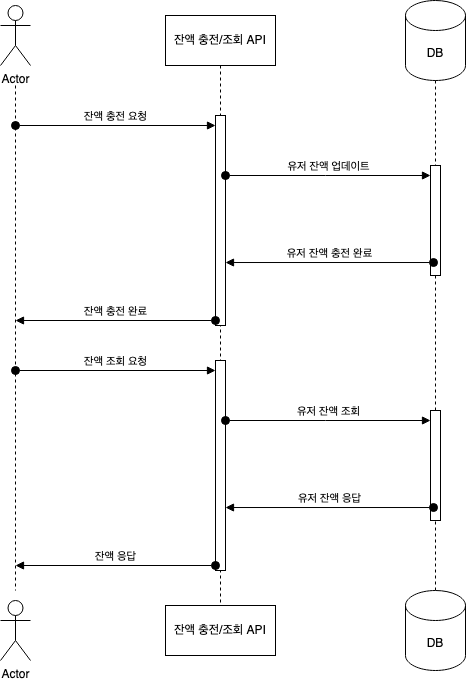
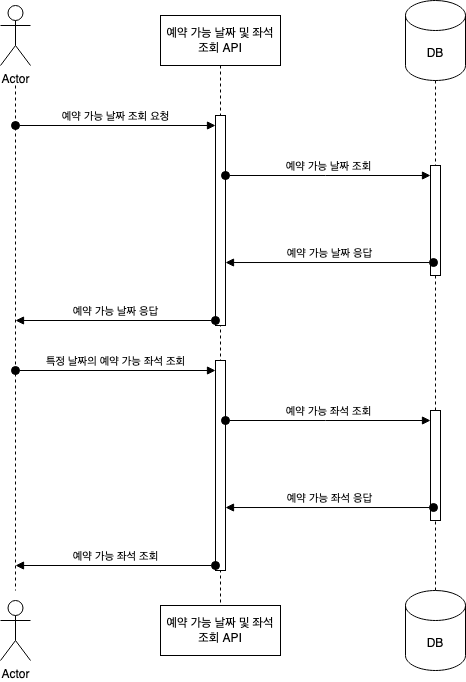
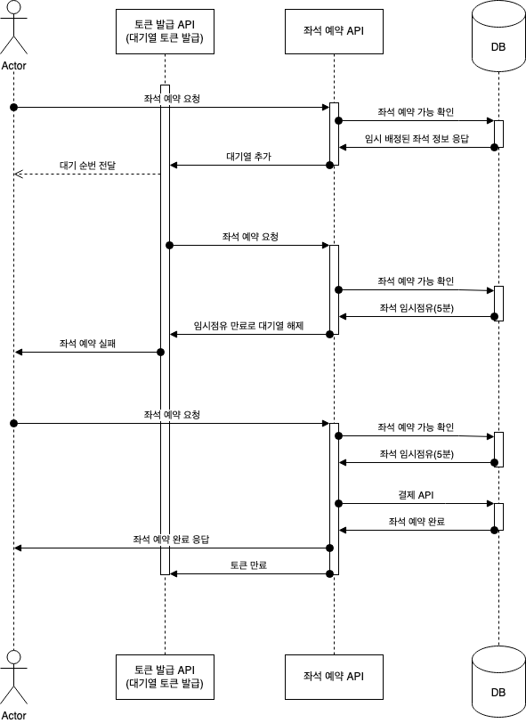
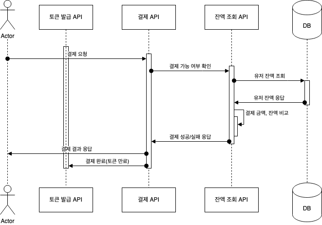

# 콘서트 예약 서비스

<br>

## 마일스톤
- [Github 마일스톤 링크](https://github.com/users/shlish95/projects/1/views/1)

<br>

## API별 시퀀스 다이어그램
<details>
<summary>유저 토큰 발급 API</summary>


</details>

<details>
<summary>잔액 충전 및 조회 API</summary>



</details>

<details>
<summary>예약 가능 날짜 및 좌석 조회 API</summary>



</details>

<details>
<summary>좌석 예약 요청 API</summary>



</details>

<details>
<summary>결제 API</summary>



</details>

<br>

## Entity - Relationship Diagram


<br>

## Getting Started

### Prerequisites

#### Running Docker Containers

`local` profile 로 실행하기 위하여 인프라가 설정되어 있는 Docker 컨테이너를 실행해주셔야 합니다.

```bash
docker-compose up -d
```
